# Mitsuruki - FMS (Fleet Management System)
(Developer: Daniel Richards)

[View live site](https://dannymagnus.github.io/CI_MS3_Mitsuruki_FMS/)

## Table of Content

1. [Project Goals](#project-goals)
    1. [User Goals](#user-goals)
    2. [Site Owner Goals](#site-owner-goals)
2. [User Experience](#user-experience)
    1. [Target Audience](#target-audience)
    2. [User Stories](#user-stories)
    3. [Instructions](#instructions)
3. [Technical Design](#technical-design)
    1. [Flowchart](#flowchart)
    2. [Data Models](#data-models)   
4. [Technologies Used](#technologies-used)
    1. [Languages](#languages)
    2. [Frameworks and Tools](#frameworks-and-tools)
5. [Features](#features)
6. [Testing](#validation)
    1. [Python Validation](#Python-validation)
    2. [Testing user stories](#testing-user-stories)
8. [Bugs](#Bugs)
10. [Deployment](#deployment)
11. [Credits](#credits)
12. [Acknowledgements](#acknowledgements)

## Project Goals 

- The Fleet Management System is the beginning of a real world application for an automotive company engineering company. Mitsuruki has been used as a fictional as not to infringe any brand or copyright.

### User Goals
- Be able to search vehicles from an automotive engineering fleet to pick vehicles with feature fitments I wish to assess.
- Add appraisals to the database.
- Read previous appraisals of particular vehicles so issues can be raised for engineering investigation.

### Site Owner Goals
- Create an application so that drivers can easily enter vehicle appraisals.
- Create an application that is easy and intuitive to navigate and provide feedback to the user.
- Create an application that gives all appraisal data for a vehicle.

## User Experience

### Target Audience
- Vehicle assessors, engineers and managers.
- Fleet/product engineers.

### User Stories

#### First-time User 
1. As a user I want the option to search vehicles or manage appraisals
2. As a user, I want to be able to to search for a vehicle so I can assess it’s fitment and type.
3. As a user I want to be able to add my appraisal details easily.
4. As a user I want to be able to add vehicles from each of the models to the vehicle database.
5. As a user I want to be able to remove vehicles from the database.
6. As a user I want to be able to search and see appraisals submitted by drivers.
7. As a user I want to be informed if any of my choices are not valid.
8. As a user I want feedback that my choices and actions have been acknowledged and executed.

#### Site Owner
9. As a site owner, I want the user to be able to select a vehicle from the engineering fleet catalogue.
10. As a site owner, I want the fleet details to be synced to and from a google sheet.
11. As a site owner; I want users to be able to submit appraisals which are to be stored in a separate worksheet in the google sheet.
12. As a site owner, I want data entry to be validated, to guide the user on how to correctly format the input.

### Instructions

Click Here for instructions for use

#### Overview

The Mitsuruki FMS (Fleet Management System) is for the management of a collection of vehicles within the Mitsuruki car product engineering and testing team.  It's purpose is to provide an easy way for drivers to provide vehicle assessments for the engineering team to review prior to investigation of any reported issues.  This is to better develop our products before releasing them to market.

#### Main Menu

On the main menu, you will be provdided with 2 options.

Operation: Input numeric value and press enter key.

1: The vehicle menu - this contains all of the vehicles that are held for test by the engineering fleet.  The purpose of this sub menu structure is for users to be able to interogate a particular registration for feature fitments (eg. heated seats), should that be required for a particular testing usecase.

It is also for fleet owners to be able to add and remove vehicles from the database once they are de-fleeted or replaced.

2: The appraisal menu option.  This directs users to a submenu where users can submit results of a vehicle assesment and engineers can review them.

#### Vehicle Menu

Purpose: To allow users to search a vehicle by registration, add or remove a vehicle to or from the catalogue.

Operation: Input numeric value and press enter key

1: Search the vehicle by registration.

Enter Vehicle Registration: Enter a valid registration (eg VE70EKU).  Registration is not case sensitive but should be of the correct length and format.  Validation exists to prompt for errors in length, but format needs to be the diligence of the user.

2: Add vehicle: Enter details as prompted on screen 

- Enter Vehicle Registration: Enter a valid registration (eg VE70EKU).  Registration is not case sensitive but should be of the correct length and format.  Validation exists to prompt for errors in length, but format needs to be the diligence of the user.

- Enter Model: Valid model types are Slicker, Slider, Trojan, ETronic.

- Enter Colour: There are no pre-determined colour types.  Please be mindful that the colour is correct as per the manufacturer datasheet (not included here) as this maybe a search function later in time.

- Heated (y/n):  Enter using y or n only.  This option is to indicate whether heated seats are fitted or not.

- Massage (y/n): Enter using y or n only. This option is to indicate whether massage seats are fitted.  For ETronic models this option is not available.

- Confirmation of addition to database (y/n): Confirm whether to be upload to the fleet catalogue.  Confirmation will be displayed if upload is successful.

3: Remove vehicle: Enter details as prompted on screen.

- Enter Vehicle Registration: Enter a valid registration (eg VE70EKU).  Registration is not case sensitive but should be of the correct length and format.  Validation exists to prompt for errors in length, but format needs to be the diligence of the user.

- Vehicle catalogue will be searched. If such a registration exists, then a confirmation prompt will follow.

-Confirmation (y/n): Confirmation to remove from catalogue.  IMPORTANT! This action is detructive and cannot be reversed.  Please be sure this is the desired action.

4: Return to main menu: Returns user to main menu.

#### Appraisal Menu

1: Add appraisal: Enter details as promped on screen.

- Enter Vehicle Registration: Enter a valid registration (eg VE70EKU).  Registration is not case sensitive but should be of the correct length and format.  Validation exists to prompt for errors in length, but format needs to be the diligence of the user.

- Enter date of appraisal: This should be the date that the appraisal took place.  Correct format should be dd/mm/yy.

- Enter appraisal details: This should be as descriptive as possible of the issues witnessed.  Please reference symptoms only, and do not assume root cause.  e.g. No navigation maps displayed in main instrument panel, rather than navigation didn't work or navigation crashed.  Please include the time stamp of the issue e.g.(1523).

- Confirmation of upload: Confirm using (y or n) to upload appraisal to the database.

2: Search appraisal: Enter details as prompted on screen.

- Enter Vehicle Registration: Enter a valid registration (eg VE70EKU).  Registration is not case sensitive but should be of the correct length and format.  Validation exists to prompt for errors in length, but format needs to be the diligence of the user.

- Confirmation: if the vehicle exists, then a confirmation will be presented.  Pressing enter will display all appraisals for that vehicle.

3: Main Menu: This returns the user to the main menu.

## Technical Design

### Flow Chart

Below you can see the flowchart, created with [diagrammes.io](www.diagrammes.io)

Flowchart

### Data models

For this project I have used largely lists, dictionaries and 4 classes for the vehicle lines themselves.
- Classes - I have used 5 classes. One parent class of car, from which the subsequent classes inherit base values and 4 subclasses for each of the vehicle models; Slicker, Slider, ETronic and Trojan.   Each have some similar attibutes which are determined by the user and some unique attributes eg type (estate, pickup etc).
- Google sheets API.  I have chosen to use Google Sheets API so that the required data for the app will persist outside of the container.
- As the programme is working closely with Google Sheets, I have used lists and dictionaries.  List to work with adding data to the google sheet and dictionaries to search for objects within the sheets.

## Technologies Used

### Languages

- [Python 3](https://www.python.org/)

### Frameworks and Tools

1. [Git](https://git-scm.com/) - Git was used for version control within VSCode to push the code to GitHub.
2. [GitHub](https://github.com/) - GitHub was used as a remote repository to store project code. 
3. [Visual Studio Code (VSCode)](https://code.visualstudio.com/)
VSCode was the IDE used to write the remainder of the project code.
4. [Diagrams.net](https://app.diagrams.net/) - was used to draw flowchart.
5. [Google Sheets](https://www.google.co.uk/sheets/about/) - was used to store data outside of the program.  The vehicle catalogue and appraisal data stored in 2 separate sheets.
6. [Google Cloud Platform](https://cloud.google.com/cloud-console/) - was used to manage access and permissions to the google services, google auth, sheets etc.

#### Libraries

1. datetime - for date format validation and ensuring user input is not in the future.
2. gspread - used to manipulate google sheets from the python client.

## Features

### Main Menu

The main menu gives a paragraph welcome and introduction to the Fleet Management System.  It presents the user with 2 options for the Vehicle Catalogue and the Appraisal Menu respectively.

Main Menu

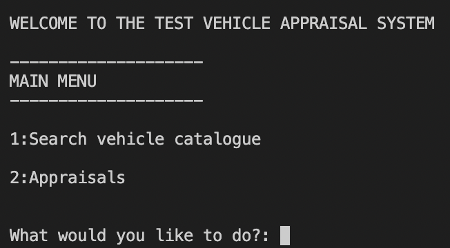

**This screen covers the following user stories:**

*1. As a user I want the option to search vehicles or manage appraisals*

### Vehicle Menu

The vehicle menu gives the user 3 options where they can search and retrieve vehicle information from a registration giving a description of the vehicle including it’s model type, and fitment of luxury items, in particular in this release, whether heated and/or massage seats are fitted.

Vehicle Menu

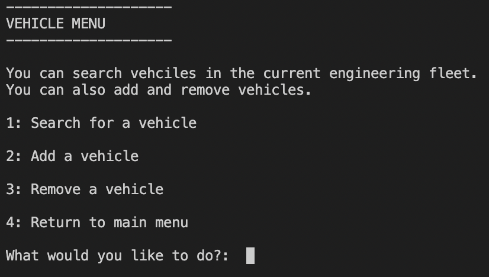

**This screen covers the following user stories:**

*1. As a user I want the option to search vehicles or manage appraisals.*

*7. As a user I want to be informed if any of my choices are not valid.*

*8. As a user I want feedback that my choices and actions have been acknowledged and executed.*

*9. As a site owner, I want the user to be able to select a vehicle from the engineering fleet catalogue.*

*12. As a site owner, I want data entry to be validated, to guide the user on how to correctly format the input.*

#### Search vehicle

This give the user the function of searching the fleet database by registration to return the full vehicle description including any special fitment such as heated or massage seats, so the user can assess the vehicle before booking for an appraisal.  This can also be used by engineers to find the spec of the vehicle after an appraisal.  This function will search vehicles on record and return an error if no such vehicle exists.  It will also validate data entry to a degree (eg. Reg length etc).  It does rely to a degree that the user is in earnest trying to complete entry successfully.  Once located, a prompt will be given to ask if the user wishes to display the data.

Search Vehicle

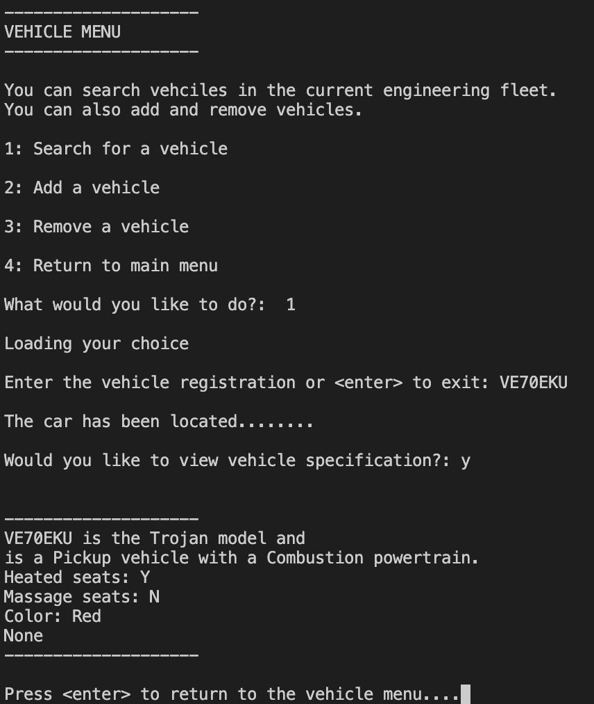

**This screen covers the following user stories:**

*1. As a user I want the option to search vehicles or manage appraisals*

*2. As a user, I want to be able to to search for a vehicle so I can assess it’s fitment and type.*

*7. As a user I want to be informed if any of my choices are not valid.*

*8. As a user I want feedback that my choices and actions have been acknowledged and executed.*

*9. As a site owner, I want the user to be able to select a vehicle from the engineering fleet catalogue.*

*12. As a site owner, I want data entry to be validated, to guide the user on how to correctly format the input.*

#### Add Vehicle

This give the user the function of adding a vehicle to the fleet database.  The user will be prompted for the key values, registration, model, colour and fitments. If data validation is successful then the user has the option to add the vehicle.

Add vehicle

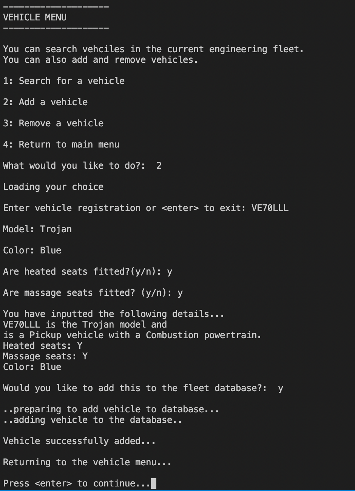
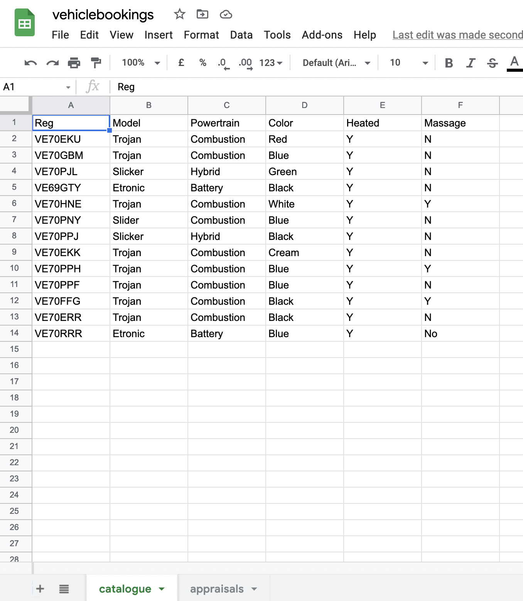

**This screen covers the following user stories:**

*4. As a user I want to be able to add vehicles from each of the models to the vehicle database.*

*7. As a user I want to be informed if any of my choices are not valid.*

*8. As a user I want feedback that my choices and actions have been acknowledged and executed.*

*9. As a site owner, I want the user to be able to select a vehicle from the engineering fleet catalogue.*

*10. As a site owner, I want the fleet details to be synced to and from a google sheet.*

*12. As a site owner, I want data entry to be validated, to guide the user on how to correctly format the input.*

#### Remove Vehicle

This gives the user the function of removing a vehicle from the fleet database.  The user will be prompted for the key values, registration. If data validation is successful and the vehicle exist in the database, and the user confirms the prompt then the vehicle will be removed.

Remove vehicle

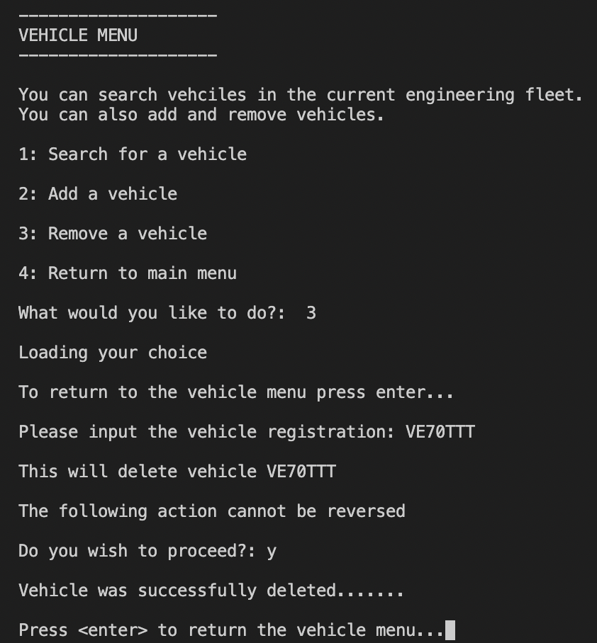

**This screen covers the following user stories:**

*5. As a user I want to be able to remove vehicles from the database.*

*7. As a user I want to be informed if any of my choices are not valid.*

*8. As a user I want feedback that my choices and actions have been acknowledged and executed.*

*9. As a site owner, I want the user to be able to select a vehicle from the engineering fleet catalogue.*

*10. As a site owner, I want the fleet details to be synced to and from a google sheet.*

*12. As a site owner, I want data entry to be validated, to guide the user on how to correctly format the input.*

### Appraisal Menu

The appraisal menu gives the user 2 options where they can add and search vehicle appraisals.  Drivers/users can submit their experience as an appraisal and then engineers and fleet/vehicle owners can review the data provided and raise issues for engineers to investigate.

Appraisal Menu

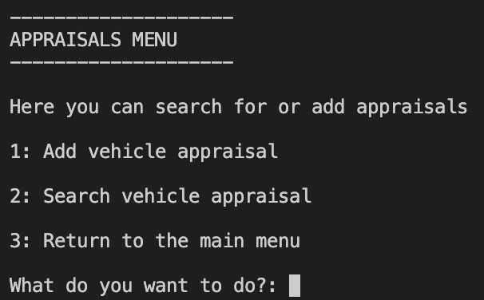

**This screen covers the following user stories:**

*1. As a user I want the option to search vehicles or manage appraisals.*

*3. As a user I want to be able to add my appraisal details easily.*

*7. As a user I want to be informed if any of my choices are not valid.*

*8. As a user I want feedback that my choices and actions have been acknowledged and executed.*

*12. As a site owner, I want data entry to be validated, to guide the user on how to correctly format the input.*

#### Add Appraisal

This give the user the function of adding an appraisal report to the FMS database(google sheet). The user is prompted to enter vehicle registration, and if vehicle exists, date and then the appraisal details.  The user will then have the option to add this report to the database.

Add appraisal

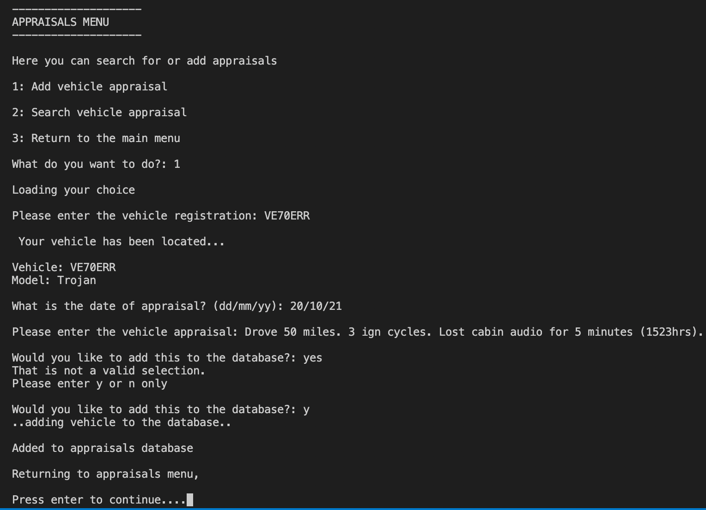

**This screen covers the following user stories:**

*3. As a user I want to be able to add my appraisal details easily.*

*7. As a user I want to be informed if any of my choices are not valid.*

*8. As a user I want feedback that my choices and actions have been acknowledged and executed.*

*11. As a site owner; I want users to be able to submit appraisals which are to be stored in a separate worksheet in the google sheet.*

*12. As a site owner, I want data entry to be validated, to guide the user on how to correctly format the input.*

#### Search Appraisal

This give the user the function of searching an appraisal report to the FMS database(google sheet). The user is prompted to enter vehicle registration, and if vehicle exists the user will issued a prompt which allows them to display all of the appraisals linked to that vehicle.

Search appraisal

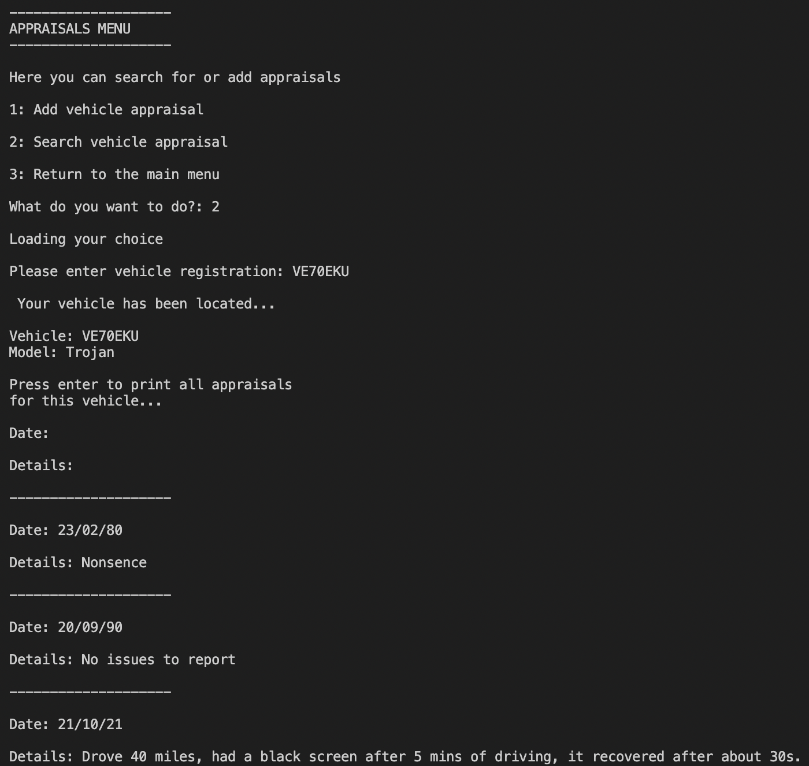

**This screen covers the following user stories:**

*3. As a user I want to be able to add my appraisal details easily.*

*7. As a user I want to be informed if any of my choices are not valid.*

*8. As a user I want feedback that my choices and actions have been acknowledged and executed.*

*12. As a site owner, I want data entry to be validated, to guide the user on how to correctly format the input.*

## Validation

### Python Validation
The Python code of the each module was validated using [PEP8 Validation Service](http://pep8online.com/).  All modules returned a pass with 0 errors and 0 warnings.

run.py

sheet1.py

vehicles.py

### Testing user stories

1. As a user I want the option to search vehicles or manage appraisals

| **Feature** | **Action** | **Expected Result** | **Actual Result** |
|-------------|------------|---------------------|-------------------|
| Find main menu       |      Select option 1       | User is presented with Vehicle sub-menu | Works as expected |
| Find main menu  |   Select option 2   | User is presented with Vehicle Appraisals submenu | Works as expected |

Screenshots

2. As a user, I want to be able to to search for a vehicle so I can assess it’s fitment and type.

| **Feature** | **Action** | **Expected Result** | **Actual Result** |
|-------------|------------|---------------------|-------------------|
| Find Vehicle Menu  |   Select option 1   | Displays input reg | Works as expected |
| Find reg input prompt  |   Enter vehicle registration   | Returns prompt if vehicle exists to display vehicle details OR notifies if reg not found | Works as expected |
| Print vehicle details prompt  |   Select to display vehicle details   | Displays vehicle description | Works as expected |

Screenshots

3. As a user I want to be able to add my appraisal details easily.

| **Feature** | **Action** | **Expected Result** | **Actual Result** |
|-------------|------------|---------------------|-------------------|
| Find Appraisals Menu      |      Select option 1      | Prompt appears to enter vehicle registration | Works as expected |
| Enter vehicle registration prompt      |     User enters vehicle reg      |   If vehicle exists user prompted to enter appraisal details OR returns not found | Works as expected |
| Enter appraisal date and details  |  Prompt displayed to update database. |  Confirmation is shown that data has been uploaded  |Works as expected. |
| Update database prompt  |  Select to update OR cancel. |  Database updated with confirmation OR returns to Appraisal Menu  | Works as expected  |

Screenshots

4. As a user I want to be able to add vehicles from each of the models to the vehicle database.

| **Feature** | **Action** | **Expected Result** | **Actual Result** |
|-------------|------------|---------------------|-------------------|
|  Find Add Vehicle Menu Option     |      Enter vehicle details  |   Confirmation displayed with prompt to add to database | Works as expected |
| Update database prompt | Select to update OR cancel | Database updated with confirmation OR return to menu | Works as expected  |

Screenshots

5. As a user I want to be able to remove vehicles from the database.

| **Feature** | **Action** | **Expected Result** | **Actual Result** |
|-------------|------------|---------------------|-------------------|
|  Find Remove Vehicle Menu Option     |      Enter vehicle registration  |   Confirmation displayed with prompt to remove from database | Works as expected |
| Update database prompt | Select to update OR cancel | Database updated with confirmation OR return to menu | Works as expected  |

Screenshots

6. As a user I want to be able to search and see appraisals submitted by drivers.

| **Feature** | **Action** | **Expected Result** | **Actual Result** |
|-------------|------------|---------------------|-------------------|
| Search Appraisal Option    |      Enter vehicle registration and confirm prompt if vehicle is located   |  User is presented with all appraisal data for the vehicle selected  | Works as expected |

Screenshots

7. As a user I want to be informed if any of my choices are not valid.

| **Feature** | **Action** | **Expected Result** | **Actual Result** |
|-------------|------------|---------------------|-------------------|
| Vehicle Reg length Validation     |      Enter incorrect reg length     |  Error message displayed with reason and resubmit | Works as expected |
| Menu option validation  |  Enter menu option not within range or non numeric.  |  Error message displayed with reason and resubmit | Works as expected |
| Date validation  |  Enter date incorrect format |  Error message displayed with reason and resubmit | Works as expected |
| Vehicle Reg Validation (not for Add Vehicle Menu option)    |      Enter vehicle registration not contained within Google Sheet     |  Vehicle not found displayed | Works as expected |

Screenshots

8. As a user I want feedback that my choices and actions have been acknowledged and executed.

| **Feature** | **Action** | **Expected Result** | **Actual Result** |
|-------------|------------|---------------------|-------------------|
|    Find menu options   |      Select menu options   |  User recieves acknowledgement from system  |  Works as expected  | Find vehicle input  |  Input vehicle details  |  User gets acknowledgement from system  |  Works as expected  |

Screenshots

9. As a site owner, I want the user to be able to select a vehicle from the engineering fleet catalogue.

| **Feature** | **Action** | **Expected Result** | **Actual Result** |
|-------------|------------|---------------------|-------------------|
| Find Vehicle Menu  |   Select option 1   | Displays input reg | Works as expected |
| Find reg input prompt  |   Enter vehicle registration   | Returns prompt if vehicle exists to display vehicle details OR notifies if reg not found | Works as expected |
| Print vehicle details prompt  |   Select to display vehicle details   | Displays vehicle description | Works as expected |

Screenshots

10. As a site owner, I want the fleet details to be synced to and from a google sheet.

| **Feature** | **Action** | **Expected Result** | **Actual Result** |
|-------------|------------|---------------------|-------------------|
| Find Vehicle Menu  |   Add vehicle and confirm to add  | Google sheet is updated with vehcile details | Works as expected |
| Find Vehicle Menu  |   Remove vehicle and confirm to delete  | Google sheet is updated with vehcile details | Works as expected |

Screenshots

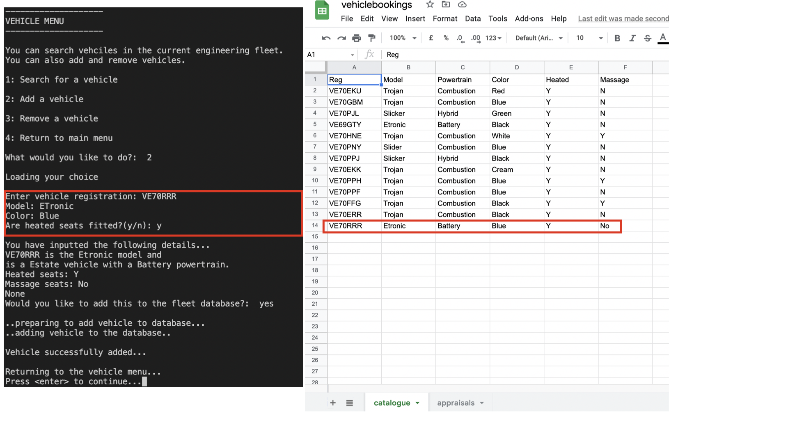
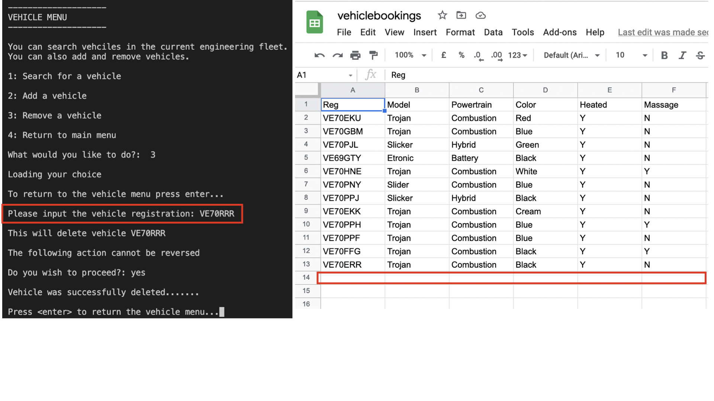

11. As a site owner; I want users to be able to submit appraisals which are to be stored in a separate worksheet in the google sheet.

| **Feature** | **Action** | **Expected Result** | **Actual Result** |
|-------------|------------|---------------------|-------------------|
| Find Appraisal Menu  |   Submit appraisals  | Google sheet is updated with appraisal details | Works as expected |

Screenshots

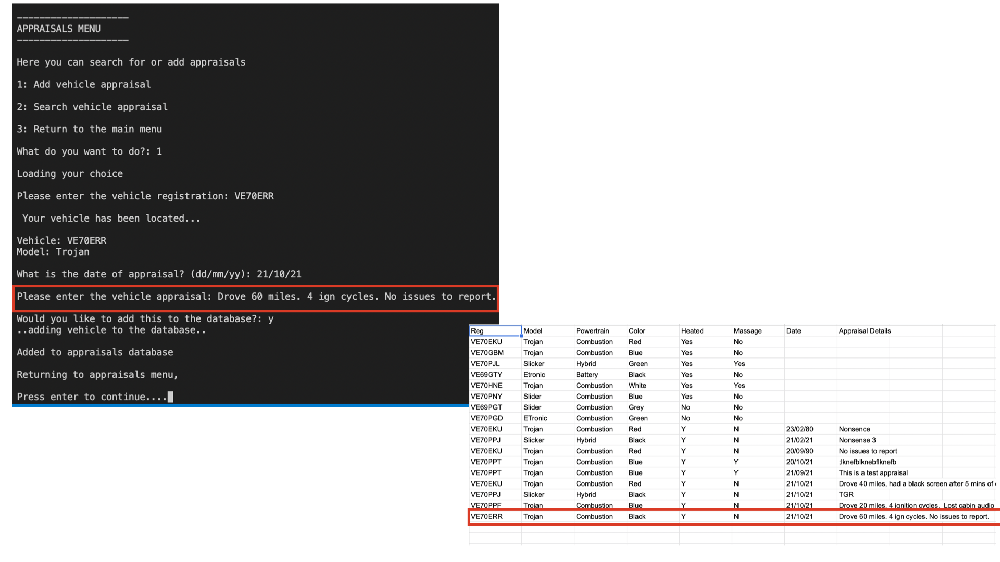

12. As a site owner, I want data entry to be validated, to guide the user on how to correctly format the input.

| **Feature** | **Action** | **Expected Result** | **Actual Result** |
|-------------|------------|---------------------|-------------------|
| Vehicle Reg length Validation     |      Enter incorrect reg length     |  Error message displayed with reason and resubmit | Works as expected |
| Menu option validation  |  Enter menu option not within range or non numeric.  |  Error message displayed with reason and resubmit | Works as expected |
| Date validation  |  Enter date incorrect format |  Error message displayed with reason and resubmit | Works as expected |
| Vehicle Reg Validation (not for Add Vehicle Menu option)    |      Enter vehicle registration not contained within Google Sheet     |  Vehicle not found displayed | Works as expected |

Screenshots

## Bugs

| **Bug** | **Fix** |
| ----------- | ----------- |
| 'Vehicle catalogue' not updating with additions or removals until programme termination and re-run |   Changed variable from being called at start of module to being a function   |
| 'Vehicle Appraisals' not updating with additions until programme termination and re-run | Changed variable from being called at start of module to being a function |
| Class inheritance failed | Correct use of super init | 
| On confirmation question for print vehicle details, no value caused traceback error  |  Added while loop to check for invalid entry  |
| Adding while loop on above caused infinate loop  |  Moved input field to interrupt  |
| Date validation failed when nonsence format added  |  Changed date validation to use datetime.strftime and datetime.strptime  |

## Deployment

### Heroku

This application has been deployed from Github using Heroku. Here's how:

1. Create an account at heroku.com
2. Create a new app, add app name and your region
3. Click on create app
4. Go to "Settings"
5. Under Config Vars, add your sensitive data (creds.json for example)
6. For this project, I set buildpacks to and in that order.
7. Go to "Deploy" and at "Deployment method", click on "Connect to Github"
8. Enter your repository name and click on it when it shows below
9. Choose the branch you want to buid your app from
10. If desired, click on "Enable Automatic Deploys", which keeps the app up to date with your Github repository

### Forking the GitHub Repository 

By forking this GitHub repository you are making a copy of the original to view or make changes without affecting the original. You can do this by following these steps...

1. Log into your GitHub account and find the [repository](https://github.com/dannymagnus/CI_MS3_MitsurukiFMS).
2. Click 'Fork' (last button on the top right of the repository page).
3. You will then have a copy of the repository in your own GitHub account. 

### Making a Local Clone

1. Log into your GitHub account and find the [repository](https://github.com/dannymagnus/CI_MS3_MitsurukiFMS).
2. Click on the 'Code' button (next to 'Add file'). 
3. To clone the repository using HTTPS, under clone with HTTPS, copy the link.
4. Then open Git Bash.
5. Change the current working directory to where you want the cloned directory to be made.
6. In your IDE's terminal type 'git clone' followed by the URL you copied.
7. Press Enter. 
8. Your local clone will now be made.

## Credits

### Code

- **Code Institute** - for git template IDE and heroku deployment instructions.
- **Google** - for library [gspread](https://docs.gspread.org/en/latest/) and [APIS](https://developers.google.com/sheets/api)
- With the exception of the above, all code was written raw and occasional reference to W3C schools for classes. No code has been borrowed from other sources.

### Acknowledgements: 

- To my mentor Mo Shami for his invaluable guidance and direction.
- To the Code Institute online resources
